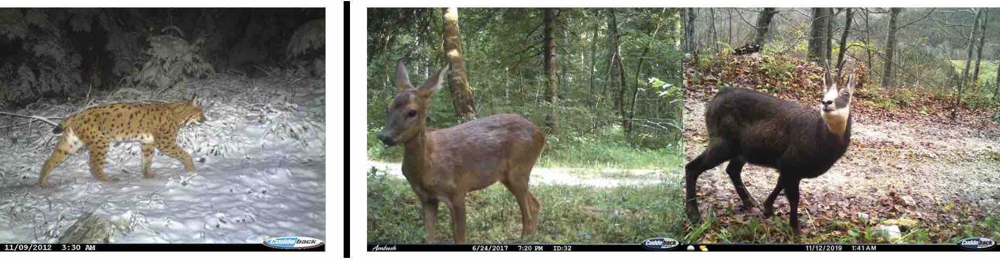
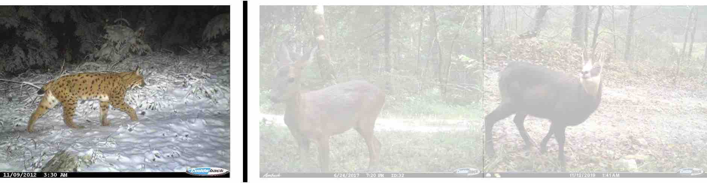
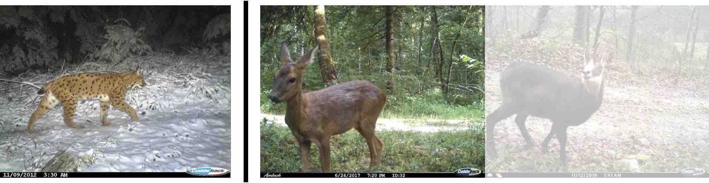
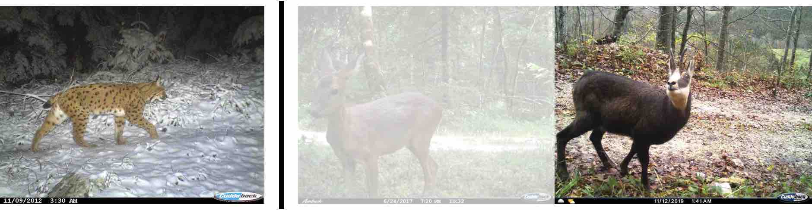
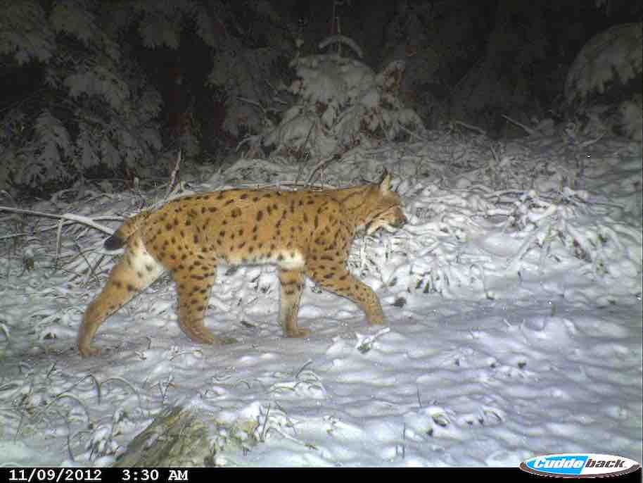
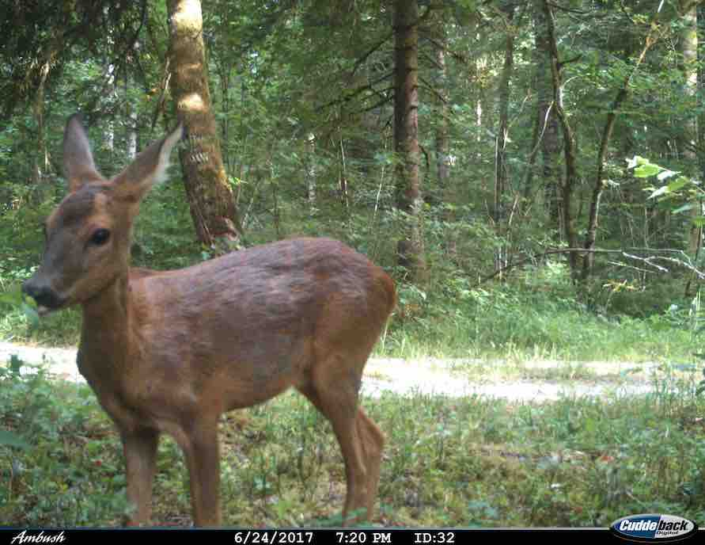
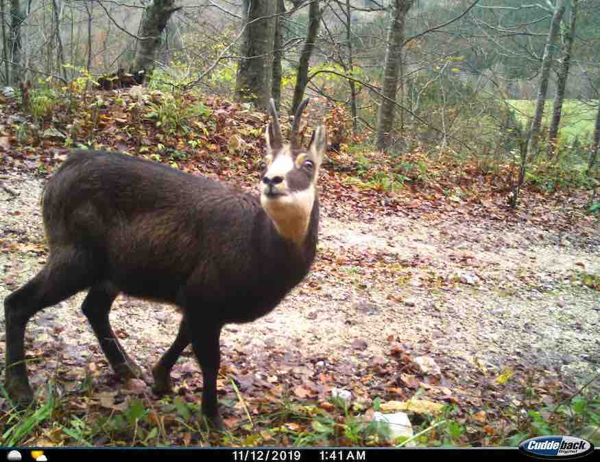

```{r setup, include=FALSE}
knitr::opts_chunk$set(tidy = FALSE, 
                      fig.width = 8, 
                      fig.height = 8, 
                      echo = FALSE,
                      warning = FALSE,
                      message = FALSE,
                      cache = FALSE)
options(htmltools.dir.version = FALSE)
set.seed(2022) # because 2019, 2020 and 2021 were not great
library(tidyverse)
theme_set(theme_light(base_size = 14))
library(sf)
library(cowplot)
library(lubridate)
library(stringi)
library(kableExtra)
library(wesanderson)
library(ggtext)
library(fastai)
library(highcharter)
library(janitor)
library(cvms)

# visualise occupancy data
# hack of the unmarked package plot function
plot_unmarked <- function(data) {
  x <- data
  y1 <- getY(x)
  ym <- max(y1, na.rm=TRUE)
  M <- nrow(y1)
  J <- ncol(y1)
  S <- length(x@ylist)
  y1 <- as.data.frame(do.call(rbind,x@ylist))
  colnames(y1) <- paste("obs",1:J)
  y1$site <- rep(1:M,S)
  y1$species <- as.factor(rep(names(x@ylist),each=M))
  y2 <- reshape(y1, idvar=c("site", "species"), varying=list(1:obsNum(x)),
                v.names="value", direction="long")
  y2$variable <- factor(paste("obs", y2$time))
  y2 %>%
    mutate(value = as_factor(value),
           site = as_factor(site),
           variable = fct_reorder(variable, time)) %>%
    ggplot() +
    aes(x = variable, y = site, fill = value) + 
    geom_tile() +
    scale_y_discrete(name = 'site',
                     labels = rownames(x@ylist$lynx)) + 
    facet_wrap(vars(species), ncol = 1) +
    scale_fill_manual(values=c( "#99CCFF","#FF9900"))+
    xlab('time') +
    theme(axis.text.x = element_text(angle = 90, hjust = 1))
}
```

```{r speciesdata, include = FALSE}
# Get Jura pix
load("dat/metadata_Jura.RData")
# nrow(allfiles)
allfiles %>%
  separate(DateTimeOriginal, c("years", "months", "days", "hours", "mins", "secs")) %>%
  mutate(years = replace(years, str_detect(SourceFile, "!! ATTENTION 2017 AU LIEU DE 2016 !!"), "2017")) %>%
  mutate(years = replace(years, str_detect(years, "2006"), "2016")) %>%
  mutate(years = replace(years, str_detect(years, "2011"), "2016")) %>%
  mutate(years = replace(years, str_detect(years, "2012"), "2016")) %>%
  mutate(years = as.numeric(years), 
         months = as.numeric(months),  
         days = as.numeric(days), 
         hours = as.numeric(hours), 
         mins = as.numeric(mins), 
         secs = as.numeric(secs)) %>% 
  mutate(y = years, 
         m = months,
         d = days) %>% 
  unite(Date, years, months, days, sep="-") %>%
  mutate(h = hours, mi = mins, s = secs) %>% 
  unite(Time, hours, mins, secs, sep=":") %>%
  unite(DateTime, Date, Time, sep=" ") %>%
  mutate(DateTime = ymd_hms(DateTime)) %>%
  select(FileName, Directory, Keywords, DateTime, y, m, d, h , mi, s) -> allpic_Jura
# min(allpic_Jura$DateTime)
# max(allpic_Jura$DateTime)
# Get trap id.
trapic_final_Jura <- allpic_Jura %>% 
  separate(FileName, c("value", "value2", "key"), extra = "merge") %>% 
  unite("n_point",value, value2, sep=".") %>% 
  arrange(desc(as.numeric(n_point))) %>% 
  separate_rows(sep=",", Keywords, convert = TRUE) %>% 
  mutate(especes = Keywords) %>%
  mutate(especes = stri_replace_all_fixed(especes, "vehicule", "humain"),
         especes = stri_replace_all_fixed(especes, "chien", "humain"),
         especes = stri_replace_all_fixed(especes, "cavalier", "humain"),
         especes = stri_replace_all_fixed(especes, "chasseur", "humain"),
         especes = stri_replace_all_fixed(especes, "frequentationhumaine", "humain"),
         especes = stri_replace_all_fixed(especes, "vaches", "humain")) %>%
  filter(especes %in% c('lynx','chevreuil','chamois','chat','renard'))
# Format occupancy data
tocc <- trapic_final_Jura %>%
  mutate(especes = as_factor(especes),
         n_point = as_factor(n_point)) %>%
  mutate(mois = month(DateTime)) %>%
  group_by(mois,n_point,especes,.drop = FALSE) %>%
  count() %>%
  filter(between(mois, 3, 11)) 
# Table of detections and non-detections for lynx. 
dat_lynx <- tocc %>%
  filter(especes == 'lynx') %>% 
  mutate(counts = if_else(n == 0, 0, 1)) %>%
  ungroup() %>%
  select(mois,n_point,counts) %>%
  pivot_wider(names_from = mois, values_from = counts) %>% 
  as.data.frame() 
# Roe deer
dat_chevreuil <- tocc %>%
  filter(especes == 'chevreuil') %>% 
  mutate(counts = if_else(n == 0, 0, 1)) %>%
  ungroup() %>%
  select(mois,n_point,counts) %>%
  pivot_wider(names_from = mois, values_from = counts) %>% 
  as.data.frame() 
# Chamois
dat_chamois <- tocc %>%
  filter(especes == 'chamois') %>% 
  mutate(counts = if_else(n == 0, 0, 1)) %>%
  ungroup() %>%
  select(mois,n_point,counts) %>%
  pivot_wider(names_from = mois, values_from = counts) %>% 
  as.data.frame() 
# Fox
dat_renard <- tocc %>%
  filter(especes == 'renard') %>% 
  mutate(counts = if_else(n == 0, 0, 1)) %>%
  ungroup() %>%
  select(mois,n_point,counts) %>%
  pivot_wider(names_from = mois, values_from = counts) %>% 
  as.data.frame() 
# Cat
dat_chat <- tocc %>%
  filter(especes == 'chat') %>% 
  mutate(counts = if_else(n == 0, 0, 1)) %>%
  ungroup() %>%
  select(mois,n_point,counts) %>%
  pivot_wider(names_from = mois, values_from = counts) %>% 
  as.data.frame() 
# Gather everything for later use
dat_jura <- list(deer = dat_chevreuil,
                 lynx = dat_lynx,
                 chamois = dat_chamois,
                 cat = dat_chat,
                 fox = dat_renard)

# Get Ain data, pictures manually labelled
load('dat/metadata_Ain.RData')
# nrow(allfiles)
allfiles %>%
  mutate(Keywords = observed) %>% # pick manual tags
  separate(DateTimeOriginal, c("years", "months", "days", "hours", "mins", "secs")) %>%
  mutate(years = as.numeric(years), 
         months = as.numeric(months),  
         days = as.numeric(days), 
         hours = as.numeric(hours), 
         mins = as.numeric(mins), 
         secs = as.numeric(secs)) %>% 
  mutate(y = years, 
         m = months,
         d = days) %>% 
  unite(Date, years, months, days, sep="-") %>%
  mutate(h = hours, mi = mins, s = secs) %>% 
  unite(Time, hours, mins, secs, sep=":") %>%
  unite(DateTime, Date, Time, sep=" ") %>%
  mutate(DateTime = ymd_hms(DateTime)) %>%
  mutate(FileName = pix) %>%
  select(FileName, Directory, Keywords, DateTime, y, m, d, h , mi, s) -> allpic_Ain
# min(allpic$DateTime, na.rm = TRUE)
# max(allpic$DateTime, na.rm = TRUE)
# Get trap id
trapic_final_Ain <- allpic_Ain %>% 
  separate(FileName, c("value", "value2", "key"), extra = "merge") %>% 
  unite("n_point",value, value2, sep=".") %>% 
  arrange(desc(as.numeric(n_point))) %>% 
  filter(Keywords %in% c('lynx','chevreuil','chamois','chat','renard')) %>%
  mutate(Keywords = fct_drop(Keywords))
# Format occupancy data
tocc <- trapic_final_Ain %>%
  mutate(especes = as_factor(Keywords),
         n_point = as_factor(n_point)) %>%
  mutate(mois = month(DateTime)) %>%
  group_by(mois,n_point,especes,.drop = FALSE) %>%
  count() %>%
  filter(between(mois, 3, 11)) 
# Table of detections and non-detections for roe deer. 
dat_chevreuil <- tocc %>%
  filter(especes == 'chevreuil') %>% 
  mutate(counts = if_else(n == 0, 0, 1)) %>%
  ungroup() %>%
  select(mois,n_point,counts) %>%
  pivot_wider(names_from = mois, values_from = counts) %>% 
  as.data.frame() 
# lynx
dat_lynx <- tocc %>%
  filter(especes == 'lynx') %>% 
  mutate(counts = if_else(n == 0, 0, 1)) %>%
  ungroup() %>%
  select(mois,n_point,counts) %>%
  pivot_wider(names_from = mois, values_from = counts) %>% 
  as.data.frame() 
# Chamois. 
dat_chamois <- tocc %>%
  filter(especes == 'chamois') %>% 
  mutate(counts = if_else(n == 0, 0, 1)) %>%
  ungroup() %>%
  select(mois,n_point,counts) %>%
  pivot_wider(names_from = mois, values_from = counts) %>% 
  as.data.frame() 
# Fox
dat_renard <- tocc %>%
  filter(especes == 'renard') %>% 
  mutate(counts = if_else(n == 0, 0, 1)) %>%
  ungroup() %>%
  select(mois,n_point,counts) %>%
  pivot_wider(names_from = mois, values_from = counts) %>% 
  as.data.frame() 
# Cat
dat_chat <- tocc %>%
  filter(especes == 'chat') %>% 
  mutate(counts = if_else(n == 0, 0, 1)) %>%
  ungroup() %>%
  select(mois,n_point,counts) %>%
  pivot_wider(names_from = mois, values_from = counts) %>% 
  as.data.frame() 
# Gather data together
dat_ain <- list(deer = dat_chevreuil,
                lynx = dat_lynx,
                chamois = dat_chamois,
                cat = dat_chat,
                fox = dat_renard)

# Get Ain data, pictures automatically labelled
load('dat/metadata_Ain.RData')
# nrow(allfiles)
allfiles %>%
  mutate(Keywords = predicted) %>% # pick automatic tags
  separate(DateTimeOriginal, c("years", "months", "days", "hours", "mins", "secs")) %>%
  mutate(years = as.numeric(years), 
         months = as.numeric(months),  
         days = as.numeric(days), 
         hours = as.numeric(hours), 
         mins = as.numeric(mins), 
         secs = as.numeric(secs)) %>% 
  mutate(y = years, 
         m = months,
         d = days) %>% 
  unite(Date, years, months, days, sep="-") %>%
  mutate(h = hours, mi = mins, s = secs) %>% 
  unite(Time, hours, mins, secs, sep=":") %>%
  unite(DateTime, Date, Time, sep=" ") %>%
  mutate(DateTime = ymd_hms(DateTime)) %>%
  mutate(FileName = pix) %>%
  select(FileName, Directory, Keywords, DateTime, y, m, d, h , mi, s) -> allpic_Ain
# min(allpic$DateTime, na.rm = TRUE)
# max(allpic$DateTime, na.rm = TRUE)
# Get trap id
trapic_final_Ain <- allpic_Ain %>% 
  separate(FileName, c("value", "value2", "key"), extra = "merge") %>% 
  unite("n_point",value, value2, sep=".") %>% 
  arrange(desc(as.numeric(n_point))) %>% 
  filter(Keywords %in% c('lynx','chevreuil','chamois','chat','renard')) %>%
  mutate(Keywords = fct_drop(Keywords))
# Format occupancy data
tocc <- trapic_final_Ain %>%
  mutate(especes = as_factor(Keywords),
         n_point = as_factor(n_point)) %>%
  mutate(mois = month(DateTime)) %>%
  group_by(mois,n_point,especes,.drop = FALSE) %>%
  count() %>%
  filter(between(mois, 3, 11)) 
# Table of detections and non-detections for roe deer. 
dat_chevreuil <- tocc %>%
  filter(especes == 'chevreuil') %>% 
  mutate(counts = if_else(n == 0, 0, 1)) %>%
  ungroup() %>%
  select(mois,n_point,counts) %>%
  pivot_wider(names_from = mois, values_from = counts) %>% 
  as.data.frame() 
# lynx
dat_lynx <- tocc %>%
  filter(especes == 'lynx') %>% 
  mutate(counts = if_else(n == 0, 0, 1)) %>%
  ungroup() %>%
  select(mois,n_point,counts) %>%
  pivot_wider(names_from = mois, values_from = counts) %>% 
  as.data.frame() 
# Chamois. 
dat_chamois <- tocc %>%
  filter(especes == 'chamois') %>% 
  mutate(counts = if_else(n == 0, 0, 1)) %>%
  ungroup() %>%
  select(mois,n_point,counts) %>%
  pivot_wider(names_from = mois, values_from = counts) %>% 
  as.data.frame() 
# Fox
dat_renard <- tocc %>%
  filter(especes == 'renard') %>% 
  mutate(counts = if_else(n == 0, 0, 1)) %>%
  ungroup() %>%
  select(mois,n_point,counts) %>%
  pivot_wider(names_from = mois, values_from = counts) %>% 
  as.data.frame() 
# Cat
dat_chat <- tocc %>%
  filter(especes == 'chat') %>% 
  mutate(counts = if_else(n == 0, 0, 1)) %>%
  ungroup() %>%
  select(mois,n_point,counts) %>%
  pivot_wider(names_from = mois, values_from = counts) %>% 
  as.data.frame() 
# Gather data together (obtained via deeplearning)
dat_ain_dl <- list(deer = dat_chevreuil,
                lynx = dat_lynx,
                chamois = dat_chamois,
                cat = dat_chat,
                fox = dat_renard)
# Map('-', dat_ain_dl, dat_ain)
```

# Introduction

Computer vision is a field of artificial intelligence in which a machine is taught how to extract and interpret the content of an image [@NIPS2012_4824]. Computer vision relies on deep learning that allows computational models to learn from training data -- a set of manually labelled images -- and make predictions on new data -- a set of unlabelled images [@baraniuk_science_2020; @lecun_deep_2015]. With the growing availability of massive data, computer vision with deep learning is being increasingly used to perform tasks such as object detection, face recognition, action and activity recognition or human pose estimation in fields as diverse as medicine, robotics, transportation, genomics, sports and agriculture [@andina_deep_2018]. 

In ecology in particular, there is a growing interest in deep learning for automatizing repetitive analyses on large amounts of images, such as identifying plant and animal species, distinguishing individuals of the same or different species, counting individuals or detecting relevant features [@christin_applications_2019; @lamba_deep_2019; @weinstein_computer_2018]. By saving hours of manual data analyses and tapping into massive amounts of data that keep accumulating with technological advances, deep learning has the potential to become an essential tool for ecologists and applied statisticians.

Despite the promising future of computer vision and deep learning, there are challenging issues toward their wide adoption by the community of ecologists [e.g. @wearn_responsible_2019]. First, there is a programming barrier as most algorithms are written in the `Python` language (but see [MXNet in R](https://mxnet.apache.org/versions/1.6/api/r/docs/index.html) and the [R interface to Keras](https://keras.rstudio.com/index.html)) while most ecologists are versed in `R`  [@lai_evaluating_2019]. If ecologists are to use computer vision in routine, there is a need for bridges between these two languages (through, e.g., the `reticulate` package @reticulate_ref or the `shiny` package @tabak_improving_2020). Second, ecologists may be reluctant to develop deep learning algorithms that require large amounts of computation time and consequently come with an environmental cost due to carbon emissions [@strubell2019energy]. Third, recent applications of computer vision via deep learning in ecology have focused on computational aspects and simple tasks without addressing the underlying ecological questions [@sutherland_identification_2013], or carrying out statistical data analysis to answer these questions [@gimenez_statistical_2014]. Although perfectly understandable given the challenges at hand, we argue that a better integration of the *why* (ecological questions), the *what* (automatically labelled images) and the *how* (statistics) would be beneficial to computer vision for ecology [see also @weinstein_computer_2018].

Here, we showcase a full why-what-how workflow in `R` using a case study on the structure of an ecological community (a set of co-occurring species) composed of the Eurasian lynx (*Lynx lynx*) and its two main preys. First, we introduce the case study and motivate the need for deep learning. Second we illustrate deep learning for the identification of animal species in large amounts of images, including model training and validation with a dataset of labelled images, and prediction with a new dataset of unlabelled images. Last, we proceed with the quantification of spatial co-occurrence using statistical models. 

# Collecting images with camera traps

Lynx (*Lynx lynx*) went extinct in France at the end of the 19th century due to habitat degradation, human persecution and decrease in prey availability [@vandel_distribution_2005]. The species was reintroduced in Switzerland in the 1970s [@breitenmoser_large_1998], then re-colonised France through the Jura mountains in the 1980s [@vandel_distribution_2005]. The species is listed as endangered under the 2017 IUCN Red list and is of conservation concern in France due to habitat fragmentation, poaching and collisions with vehicles. The Jura holds the bulk of the French lynx population. 

To better understand its distribution, we need to quantify its interactions with its main preys, roe deer (*Capreolus capreolus*) and chamois (*Rupicapra rupicapra*) [@molinari-jobin_variation_2007], two ungulate species that are also hunted. To assess the relative contribution of predation and hunting to the community structure and dynamics, a predator-prey program was set up jointly by the French Office for Biodiversity, the Federations of Hunters from the Jura, Ain and Haute-Savoie counties and the French National Centre for Scientific Research. 
Animal detections were made using a set of camera traps in the Jura mountains that were deployed in the Jura and Ain counties (see Figure 1). Altitude in the Jura site ranges from 520m to 1150m, and from 400m to 950m for the Ain site. Woodland areas cover 69% of the Ain site, with deciduous forests (63%) followed by coniferous (19.5%) and mixed forest (12.5%). In the Jura site, woodland areas cover 62% of the area, with mixed forests (46.6%), deciduous forests (37.3%) and coniferous (14%). In both sites, the remaining habitat is meadows used by cattle.

We divided the two study areas into grids of 2.7 $\times$ 2.7 km cells or sites hereafter [@zimmermann_optimizing_2013] in which we set two camera traps per site (Xenon white flash with passive infrared trigger mechanisms, model Capture, Ambush and Attack; Cuddeback), with `r lapply(dat_jura, nrow)$lynx` sites in the Jura study area, and `r lapply(dat_ain, nrow)$lynx` in the Ain study area that were active over the study period (from February 2016 to October 2017 for the Jura county, and from February 2017 to May 2019 for the Ain county). The location of camera traps was chosen to maximise lynx detection. More precisely, camera traps were set up along large paths in the forest, on each side of the path at 50cm high. Camera traps were checked weekly to change memory cards, batteries and to remove fresh snow after heavy snowfall. 

```{r studysite, fig.width = 10, fig.cap = "**Figure 1**: Study area, grid and camera trap locations."}
site_jura <- st_read("shp/SIG_39/communes_site_etude_jura.shp", quiet = TRUE)
area_jura <- st_read("shp/SIG_39/grille_jura_2.7x2.7.shp", quiet = TRUE)
trap_jura <- st_read("shp/SIG_39/Pieges_photos_JURA_l93.shp", quiet = TRUE)
st_crs(site_jura) <-  2154
st_crs(area_jura) <-  2154
st_crs(trap_jura) <-  2154

fig1a <- ggplot() + 
  geom_sf(data = site_jura) +
  geom_sf(data = area_jura,  alpha = 0.5) + 
  geom_sf(data = trap_jura, col = "black", shape = 4, size = 3) +  
  ggtitle("A. Jura county") 

site_ain <- st_read("shp/SIG_01/Ain_ZE.shp", quiet = TRUE) # l'aire d'etude
area_ain <- st_read("shp/SIG_01/Maille_2.7_Ain.shp", quiet = TRUE) # la grille pour les pieges
trap_ain <- st_read("shp/SIG_01/PP01_restreint.shp", quiet = TRUE)
st_crs(site_ain) <-  2154
st_crs(area_ain) <-  2154
st_crs(trap_ain) <-  2154

fig1b <- ggplot() + 
  geom_sf(data = site_ain) +
  geom_sf(data = area_ain,  alpha = 0.5) + 
  geom_sf(data = trap_ain, col = "black", shape = 4, size = 3) +
  ggtitle("B. Ain county")

plot_row <- plot_grid(fig1a, fig1b)
plot_row
```

```{r}
species_Jura <- allpic_Jura %>% 
  separate(FileName, c("value", "value2", "key"), extra = "merge") %>% 
  unite("n_point",value, value2, sep=".") %>% 
  arrange(desc(as.numeric(n_point))) %>% 
  separate_rows(sep=",", Keywords, convert = TRUE) %>% 
  mutate(especes = as_factor(Keywords)) %>%
  filter(!is.na(especes), 
         !especes%in%c("Non identifié", "Non id", "Non iden", "")) %>%
  mutate(especes = fct_recode(especes, 
                              "sanglier" = "sangli",
                              "humain" = "humai",
                              "chat" = "chat forestier",
                              "chat" = "chat domestique",
                              "chasseur" = "chasse",
                              "sanglier" = "sangliers",
                              "blaireau" = "blaireaux")) 
species_Ain <- allpic_Ain %>% 
  separate(FileName, c("value", "value2", "key"), extra = "merge") %>% 
  unite("n_point",value, value2, sep=".") %>% 
  arrange(desc(as.numeric(n_point))) %>% 
  separate_rows(sep=",", Keywords, convert = TRUE) %>% 
  mutate(especes = as_factor(Keywords)) %>%
  filter(!is.na(especes), 
         !especes%in%c("Non identifié", "Non id", "Non iden", "")) %>%
  mutate(especes = fct_recode(especes, 
                              "sanglier" = "sangliers",
                              "blaireau" = "blaireaux")) 
```


In total, `r nrow(species_Jura)` and `r nrow(species_Ain)` pictures were considered in the Jura and Ain sites respectively after manually droping empty pictures and pictures with unidentified species. Note that classifying empty images could be automatised with deep learning [@norouzzadeh_deep_2021; @tabak_improving_2020]. We identified the species present on all images by hand (see Table 1) using `digiKam` a free open-source digital photo management application (<https://www.digikam.org/>). This operation took several weeks of labor full time, which is often identified as a limitation of camera trap studies. To expedite this tedious task, computer vision with deep learning has been identified as a promising approach [@norouzzadeh_deep_2021; @tabak_machine_2019; @willi_identifying_2019].
<!-- Labelled images for the Ain county are available from <https://mycore.core-cloud.net/index.php/s/1DHbKdQzPKuDbxl> and that for the Jura county are available from <https://mycore.core-cloud.net/index.php/s/8GsYfAoyeDGzuNY>.  -->  

```{r categories, results="asis", cache = FALSE}
cat("
<style>
caption {
      color: black;
      font-size: 1.2em;
    }
</style>
")
n_Jura <- species_Jura %>% count(especes, sort = TRUE) %>% slice_head(n = 10) %>% 
  mutate(especes = fct_recode(especes,
                              "human" = "humain",
                              "vehicule" = "véhicule",
                              "dog" = "chien",
                              "fox" = "renard",
                              "wild boar" = "sanglier",
                              "roe deer" = "chevreuil",
                              "cat" = "chat",
                              "badger" = "blaireau")) %>%
  rename("Species in Jura study site" = especes)
n_Ain <- species_Ain %>% count(especes, sort = TRUE) %>% slice_head(n = 10) %>% 
  mutate(especes = fct_recode(especes,
                              "human" = "humain",
                              "dog" = "chien",
                              "fox" = "renard",
                              "wild boar" = "sanglier",
                              "roe deer" = "chevreuil",
                              "cat" = "chat",
                              "badger" = "blaireau",
                              "hunter" = "chasseur",
                              "rider" = "cavalier")) %>%
  rename("Species in Ain study site" = especes)
cbind(n_Jura, n_Ain) %>% 
  kable(caption = "**Table 1**: Species identified in the Jura and Ain study sites with samples size (n). Only first 10 species with most images are shown.") %>% 
  kable_styling()
```


# Deep learning for species identification

Using the images we obtained with camera traps (Table 1), we trained a model for identifying species using the Jura study site as a calibration dataset. We then assessed this model's ability to automatically identify species on a new dataset, also known as transferability, using the Ain study site as an evaluation dataset. Even though in the present work we quantified co-occurrence between lynx and its prey, we included other species in the training to investigate the structure and dynamics of the entire community in future work. Also, the use of specific species categories instead of just a "other" category besides the focal species should help the algorithm to determine with better confidence when a picture does not contain a focal species in situations where there is no doubt that this is another species (think of a vehicle for example), or where a species is detected with which a focal species can be confused, e.g. lynx with fox. 

## Training - Jura study site

We selected at random 80\% of the annotated images for each species in the Jura study site for training, and 20\% for testing. We applied various transformations (flipping, brightness and contrast modifications following @shorten_survey_2019) to improve training (see Appendix). To reduce model training time and overcome the small number of images, we used transfer learning [@Yosinski2014; @shao_transfer_2015] and considered a pre-trained model as a starting point. Specifically, we trained a deep convolutional neural network (ResNet-50) architecture [@he_deep_2016] using the `fastai` library (https://docs.fast.ai/) that implements the `PyTorch` library [@NEURIPS2019_9015]. Interestingly, the `fastai` library comes with an `R` interface (https://eagerai.github.io/fastai/) that uses the `reticulate` package to communicate with `Python`, therefore allowing `R` users to access up-to-date deep learning tools. We trained models on the Montpellier Bioinformatics Biodiversity platform using a GPU machine (Titan Xp nvidia) with 16Go of RAM. We used 20 epochs which took approximately 10 hours. The computational burden prevented us from providing a full reproducible analysis, but we do so with a subsample of the dataset in the Appendix. All trained models are available from https://doi.org/10.5281/zenodo.5164796.

Using the testing dataset, we calculated three metrics to evaluate our model performance at correctly identifying species [e.g. @Duggan2021]. Specifically, we relied on *accuracy* the ratio of correct predictions to the total number of predictions, *recall* a measure of false negatives (FN; e.g. an image with a lynx for which our model predicts another species) with recall = TP / (TP + FN) where TP is for true positives, and *precision* a measure of false positives (FP; e.g. an image with any species but a lynx for which our model predicts a lynx) with precision = TP / (TP + FP). In camera trap studies, a strategy [@Duggan2021] consists in optimizing precision if the focus is on rare species (lynx), while recall should be optimized if the focus is on commom species (chamois and roe deer). 

We achieved 85\% accuracy during training. Our model had good performances for the three classes we were interested in, with 87\% precision for lynx and 81\% recall for both roe deer and chamois (Table 2). 

```{r perf, results="asis", cache = FALSE}
cat("
<style>
caption {
      color: black;
      font-size: 1.2em;
    }
</style>
")
options(knitr.kable.NA = '')
read_csv2("dat/perf_fastai.csv") %>% 
  clean_names() %>%
  kable(caption = "**Table 2**: Model performance metrics. Images from the Jura study site were used for training.") %>%
  kable_styling() %>%
  column_spec(1, bold = TRUE)
```

## Transferability - Ain study site

We evaluated transferability for our trained model by predicting species on images from the Ain study site which were not used for training. Precision was 77\% for lynx, and while we achieved 86\% recall for roe deer, our model performed poorly for chamois with 8\% recall (Table 3). 

```{r transf, results="asis", cache = FALSE}
cat("
<style>
caption {
      color: black;
      font-size: 1.2em;
    }
</style>
")
load("dat/pixAinannot.RData")
## compute accuracy
#tmp <- unclass(table(tt_final$predicted,tt_final$observed))
#mask <- colnames(tmp)[!colnames(tmp) %in% rownames(tmp)]
#tmp <- tmp[,!colnames(tmp)%in%mask]
#caret::confusionMatrix(tmp)
tt_final %>%
#  add_count(observed, sort = TRUE) %>%
#  filter(n > 200) %>%
  mutate(observed = fct_recode(observed,
                              "human" = "humain",
                              "dog" = "chien",
                              "red deer" = "cerf",
                              "fox" = "renard",
                              "wild boar" = "sangliers",
                              "roe deer" = "chevreuil",
                              "cat" = "chat",
                              "badger" = "blaireaux",
                              "hunter" = "chasseur",
                              "rider" = "cavalier",
                              "marten" = "martre",
                              "cow" = "vaches",
                              "hare" = "lievre")) %>%
  mutate(observed = fct_drop(observed)) %>%
  mutate(predicted = fct_recode(predicted,
                              "human" = "humain",
                              "dog" = "chien",
                              "fox" = "renard",
                              "wild boar" = "sangliers",
                              "roe deer" = "chevreuil",
                              "cat" = "chat",
                              "badger" = "blaireaux",
                              "hunter" = "chasseur",
                              "rider" = "cavalier",
                              "red deer" = "cerf",
                              "marten" = "martre",
                              "cow" = "vaches",
                              "hare" = "lievre")) -> tt_final_clean
dout <- unclass(table(tt_final_clean$predicted, tt_final_clean$observed))
mask <- colnames(dout)[!colnames(dout) %in% rownames(dout)]
dout <- dout[,!colnames(dout)%in%mask]
true_positives  <- diag(dout)
false_positives <- colSums(dout) - true_positives
false_negatives <- rowSums(dout) - true_positives
true_negatives  <- sum(dout) - true_positives - false_positives - false_negatives
precision <- true_positives/(true_positives+false_positives)
recall <- true_positives/(true_positives+false_negatives)
data.frame(precision = round(precision,2),
           recall = round(recall,2)) %>% #, n=rowSums(dout)) %>%
  kable(caption = "**Table 3**: Model transferability performance. Images from the Ain study site were used for assessing transferability.") %>%
  kable_styling() %>%
  column_spec(1, bold = TRUE)
```

To better understand this pattern, we display the results under the form of a confusion matrix that compares model classifications to manual classifications (Figure 2). There were a lot of false negatives for chamois, meaning that when a chamois was present in an image, it was often classified as another species by our model. 

```{r figure2, fig.cap="**Figure 2**: Confusion matrix comparing automatic to manual species classifications. Species that were predicted by our model are in columns, and species that are actually in the images are in rows. Column and row percentages are also provided at the bottom and right side of each cells respectively. An example of column percentage is as follows: of all pictures for which we predict a wild boar, 75.1% actually contained a wild boar. An example of row percentage is as follows: of all pictures in which we have a wild boar, we predict 94% of them to be badgers."}
#perf_prediction <- hchart(dout, label = TRUE) %>%
#    hc_yAxis(title = list(text = 'Actual')) %>%
#    hc_xAxis(title = list(text = 'Predicted'),
#             labels = list(rotation = -90)) 
#perf_prediction
library(cvms)
d_binomial <- tibble('Actual' = tt_final_clean$observed,
                     'Predicted' = tt_final_clean$predicted)
basic_table <- table(d_binomial)
cfm <- as_tibble(basic_table)
cvms::plot_confusion_matrix(cfm, 
                            target_col = "Actual", 
                            prediction_col = "Predicted",
                            counts_col = "n", 
                            add_normalized = FALSE,
                            add_col_percentages = TRUE,
                            add_row_percentages = TRUE,
                            rm_zero_text = FALSE,
                            rotate_y_text = FALSE,
                            place_x_axis_above = FALSE) +
  labs(x = "Predicted", y = "Actual") + 
  theme(axis.text.x = element_text(angle = 90, vjust = 0.5, hjust = 1),
        axis.text.y = element_text(vjust = 0.5, hjust = 1))
```

Overall, our model trained on images from the Jura study site did poorly at correctly predicting species on images from the Ain study site. This result does not come as a surprise, as generalizing classification algorithms to new environments is known to be difficult [@beery_recognition_2018]. While a computer scientist might be disappointed in these results, an ecologist would probably wonder whether ecological inference about the co-occurrence between lynx and its prey is biased by these average performances, a question we address in the next section.  

# Spatial co-occurrence

Here, we analysed the data we acquired from the previous section. For the sake of comparison, we considered two datasets, one made of the images manually labelled for both the Jura and Ain study sites pooled together (*ground truth dataset*), and the other in which we pooled the images that were manually labelled for the Jura study site and the images that were automatically labelled for the Ain study site using our trained model (*classified dataset*). 

We formatted the data by generating monthly detection histories, that is a sequence of detections ($Y_{sit} = 1$) and non-detections ($Y_{sit} = 0$), for species $s$ at site $i$ and sampling occasion $t$ (see Figure 3).

```{r figure3, fig.cap="**Figure 3**: Detections (black) and non-detections (light grey) for each of the 3 species lynx, chamois and roe deer between March and November for all years pooled together. Sites are on the Y axis, while sampling occasions are on the X axis. Only data from the ground truth dataset are displayed.", fig.align="center"}
## Occupancy analyses
## First with manually tagged data, then with automaticaly tagged data
# my_packages <- c("unmarked")
# not_installed <- my_packages[!(my_packages %in% installed.packages()[,"Package"])]
# if(length(not_installed)) devtools::install_github("rbchan/unmarked")
library(unmarked)
# Format the data as required for package unmarked
lynx <- as.matrix(rbind(dat_ain$lynx[,-1], dat_jura$lynx[,-1]))
deer <- as.matrix(rbind(dat_ain$deer[,-1], dat_jura$deer[,-1]))
chamois <- as.matrix(rbind(dat_ain$chamois[,-1], dat_jura$chamois[,-1]))
fox <- as.matrix(rbind(dat_ain$fox[,-1], dat_jura$fox[,-1]))
cat <- as.matrix(rbind(dat_ain$cat[,-1], dat_jura$cat[,-1]))
y <- list("lynx" = lynx, "roe deer" = deer, "chamois" = chamois)
data <- unmarkedFrameOccuMulti(y=y)
# summary(data)

x <- data
y1 <- getY(x)
ym <- max(y1, na.rm=TRUE)
M <- nrow(y1)
J <- ncol(y1)
S <- length(x@ylist)
y1 <- as.data.frame(do.call(rbind,x@ylist))
colnames(y1) <- 1:J
y1$site <- rep(1:M,S)
y1$species <- as.factor(rep(names(x@ylist),each=M))
y1 %>%
  pivot_longer(cols = 1:9,
               names_to = "time",
               values_to = "value") %>%
  mutate(site = as_factor(site),
         time = as_factor(time),
         value = as_factor(value)) %>%
  ggplot() +
  aes(x = time, y = site, fill = value) + 
  geom_tile() +
  scale_y_discrete(name = 'Sites',
                   labels = rownames(x@ylist$lynx)) + 
  facet_wrap(vars(species), nrow = 1) +
  scale_fill_manual(values = c( "gray90","black"),
                    labels = c("non-detection", "detection"))+
  labs(x = 'Sampling occasions', fill = "")

y <- list(lynx = lynx, deer = deer, chamois = chamois, fox = fox, cat = cat)
data <- unmarkedFrameOccuMulti(y=y)
```

To quantify spatial co-occurrence betwen lynx and its preys, we used a multispecies occupancy modeling approach [@Rota2016] implemented in the `R` package `unmarked` [@unmarkedFiske] within the maximum likelihood framework. The multispecies occupancy model assumes that observations $y_{sit}$, conditional on $Z_{si}$ the latent occupancy state of species $s$ at site $i$ are drawn from Bernoulli random variables $Y_{sit} | Z_{si} \sim \mbox{Bernoulli}(Z_{si}p_{sit})$ where $p_{sit}$ is the detection probability of species $s$ at site $i$ and sampling occasion $t$. Detection probabilities can be modeled as a function of site and/or sampling covariates, or the presence/absence of other species, but for the sake of illustration, we will make them only species-specific here. 

The latent occupancy states are assumed to be distributed as multivariate Bernoulli random variables [@dai_multivariate_2013]. Let us consider 2 species, species 1 and 2, then $Z_i = (Z_{i1}, Z_{i2}) \sim \mbox{multivariate Bernoulli}(\psi_{11}, \psi_{10}, \psi_{01}, \psi_{00})$ where $\psi_{11}$ is the probability that a site is occupied by both species 1 and 2, $\psi_{10}$ the probability that a site is occupied by species 1 but not 2, $\psi_{01}$ the probability that a site is occupied by species 2 but not 1, and $\psi_{00}$ the probability a site is occupied by none of them. Note that we considered species-specific only occupancy probabilities but these could be modeled as site-specific covariates. Marginal occupancy probabilities are obtained as $\Pr(Z_{i1}=1) = \psi_{11} + \psi_{10}$ and $\Pr(Z_{i2}=1) = \psi_{11} + \psi_{01}$. With this model, we may also infer co-occurrence by calculating conditional probabilities such as for example the probability of a site being occupied by species 2 conditional of species 1 with $\Pr(Z_{i2} = 1| Z_{i1} = 1) = \displaystyle{\frac{\psi_{11}}{\psi_{11}+\psi_{10}}}$. 

Despite its appeal and increasing use in ecology, multispecies occupancy models can be difficult to fit to real-world data in practice. First, these models are data-hungry and regularization methods [@clipp2021] are needed to avoid occupancy probabilities to be estimated at the boundary of the parameter space or with large uncertainty. Second, and this is true for any joint species distribution models, these models quickly become very complex with many parameters to be estimated when the number of species increases and co-occurrence is allowed between all species. Here, ecological expertise should be used to consider only meaningful species interactions and apply parsimony when parameterizing models. 

We now turn to the results obtained from a model with five species namely lynx, chamois, roe deer, fox and cat and co-occurrence allowed between lynx and chamois and roe deer only. 

```{r include = FALSE, eval = TRUE}
set.seed(2022)
kk <- 10
# y <- list(lynx = lynx, deer = deer, chamois = chamois, fox = fox, cat = cat)
# f1, f2, f3, f4, f5, f12, f13, f14, f15, f23, f24, f25, f34, f35, f45, ...
occFormulas <- c('~1','~1','~1','~1','~1','~1','~1','~0','~0','~0','~0','~0','~0','~0','~0','~0','~0','~0','~0','~0','~0','~0','~0','~0','~0','~0','~0','~0','~0','~0','~0') 
detFormulas <- c('~1','~1','~1','~1','~1')
seed <- 24762
inits <- rep(0, 12)
set.seed(seed)
fit <- occuMulti(detformulas = detFormulas,
                 stateformulas = occFormulas,
                 data = data,
                 method = "Nelder-Mead",
                 control = list(maxit = 5000, reltol = 1e-4),
                 starts = rnorm(n = 12, mean = inits, sd = .5))
# look for optimal penalty
optimal_penalty <- optimizePenalty(fit,
                                   penalties = c(0.01, 0.02, 0.04, 0.08, 0.16, 0.32, 0.64, 1.28, 2.56, 5.12), 
                                   k = kk, 
                                   boot = 1)
# refit model after fixing the best penalty
fit <- occuMulti(detformulas = detFormulas, 
                 stateformulas = occFormulas, 
                 data = data,
                 control = list(maxit = 5000),
                 penalty = optimal_penalty@call$penalty) 

# Get natural parameter and detection estimates
mle <- fit@opt$par
names(mle) <- c('f1','f2','f3','f4','f5','f12','f13','lp1','lp2','lp3','lp4','lp5')
# Get occupancy estimates
psi_lynx <- predict(fit,'state',species='lynx')[1,]
psi_deer <- predict(fit,'state',species='deer')[1,]
psi_chamois <- predict(fit,'state',species='chamois')[1,]
psi_fox <- predict(fit,'state',species='fox')[1,]
psi_cat <- predict(fit,'state',species='cat')[1,]
# With SEs
psi_lynx <- head(predict(fit,'state',species="lynx"), 1)
psi_deer <- head(predict(fit,'state',species="deer"), 1)
psi_chamois <- head(predict(fit,'state',species="chamois"), 1)
# Get detection estimates
p_lynx <- plogis(mle['lp1'])
p_deer <- plogis(mle['lp2'])
p_chamois <- plogis(mle['lp3'])
p_fox <- plogis(mle['lp4'])
p_cat <- plogis(mle['lp5'])
# With SEs
se <- sqrt(diag(solve(fit@opt$hessian)))
names(se) <- c('f1','f2','f3','f4','f5','f12','f13','lp1','lp2','lp3','lp4','lp5')
p_lynx1 <- data.frame(mle = p_lynx, 
                     lci = plogis(mle['lp1'] - 1.96 * se["lp1"]), 
                     uci = plogis(mle['lp1'] + 1.96 * se["lp1"]))
p_deer1 <- data.frame(mle = p_deer, 
                     lci = plogis(mle['lp2'] - 1.96 * se["lp2"]), 
                     uci = plogis(mle['lp2'] + 1.96 * se["lp2"]))
p_chamois1 <- data.frame(mle = p_chamois, 
                        lci = plogis(mle['lp3'] - 1.96 * se["lp3"]), 
                        uci = plogis(mle['lp3'] + 1.96 * se["lp3"]))
# Conditional probabilities of occupancy
# Pr(lynx present | roe deer and chamois present)
pc1 <- predict(fit,'state',species='lynx',cond=c('deer','chamois'))[1,]
# Pr(lynx present | roe deer and chamois absent)
pc2 <- predict(fit,'state',species='lynx',cond=c('-deer','-chamois'))[1,]
# Pr(lynx present | roe deer present and chamois absent)
pc3 <- predict(fit,'state',species='lynx',cond=c('deer','-chamois'))[1,]
# Pr(lynx present | roe deer absent and chamois present)
pc4 <- predict(fit,'state',species='lynx',cond=c('-deer','chamois'))[1,]

conditional1 <- 
  structure(list(param = c("Pr(lynx present | roe deer and chamois present)", 
                           "Pr(lynx present | roe deer and chamois absent)", 
                           "Pr(lynx present | roe deer present and chamois absent)",
                           "Pr(lynx present | roe deer absent and chamois present)"), 
                 low2.5 = as_vector(c(pc1[3], pc2[3], pc3[3], pc4[3])), 
                 est = as_vector(c(pc1[1], pc2[1], pc3[1], pc4[1])), 
                 up2.5 = as_vector(c(pc1[4], pc2[4], pc3[4], pc4[4]))), 
            .Names = c("param", "low2.5", "est", "up2.5"), 
            row.names = 7:10, 
            class = c("data.frame", "mplus.params"))

marginal1 <- 
  structure(list(param = c("Pr(lynx present)", "Pr(roe deer present)", "Pr(chamois present)"), 
                 low2.5 = as_vector(c(psi_lynx[3], psi_deer[3], psi_chamois[3])), 
                 est = as_vector(c(psi_lynx[1], psi_deer[1], psi_chamois[1])), 
                 up2.5 = as_vector(c(psi_lynx[4], psi_deer[4], psi_chamois[4]))), 
            .Names = c("param", "low2.5", "est", "up2.5"), 
            row.names = 7:9, 
            class = c("data.frame", "mplus.params"))

# Format the data as required for package unmarked
lynx <- as.matrix(rbind(dat_ain_dl$lynx[,-1], dat_jura$lynx[,-1]))
deer <- as.matrix(rbind(dat_ain_dl$deer[,-1], dat_jura$deer[,-1]))
chamois <- as.matrix(rbind(dat_ain_dl$chamois[,-1], dat_jura$chamois[,-1]))
fox <- as.matrix(rbind(dat_ain_dl$fox[,-1], dat_jura$fox[,-1]))
cat <- as.matrix(rbind(dat_ain_dl$cat[,-1], dat_jura$cat[,-1]))
y <- list(lynx = lynx, deer = deer, chamois = chamois, fox = fox, cat = cat)
data <- unmarkedFrameOccuMulti(y=y)
# summary(data)
# plot(data)
# f1, f2, f3, f4, f5, f12, f13, f14, f15, f23, f24, f25, f34, f35, f45, ...
occFormulas <- c('~1','~1','~1','~1','~1','~1','~1','~0','~0','~0','~0','~0','~0','~0','~0','~0','~0','~0','~0','~0','~0','~0','~0','~0','~0','~0','~0','~0','~0','~0','~0') 
detFormulas <- c('~1','~1','~1','~1','~1')
seed <- 4223
inits <- rep(0, 12)
set.seed(seed)
fit <- occuMulti(detformulas = detFormulas,
                 stateformulas = occFormulas,
                 data = data,
                 method = "Nelder-Mead",
                 control = list(maxit = 5000, reltol = 1e-4),
                 starts = rnorm(n = 12, mean = inits, sd = .5))

# look for optimal penalty
optimal_penalty <- optimizePenalty(object = fit,
                                   penalties = c(0.01, 0.02, 0.04, 0.08, 0.16, 0.32, 0.64, 1.28, 2.56, 5.12), 
                                   k = kk, 
                                   boot = 1)
# refit model after fixing the best penalty
fit <- occuMulti(detformulas = detFormulas, 
                 stateformulas = occFormulas, 
                 data = data,
                 control = list(maxit = 5000),
                 penalty = optimal_penalty@call$penalty) 

# Get natural parameter and detection estimates
mle <- fit@opt$par
names(mle) <- c('f1','f2','f3','f4','f5','f12','f13','lp1','lp2','lp3','lp4','lp5')
# Get occupancy estimates
psi_lynx <- predict(fit,'state',species='lynx')[1,]
psi_deer <- predict(fit,'state',species='deer')[1,]
psi_chamois <- predict(fit,'state',species='chamois')[1,]
psi_fox <- predict(fit,'state',species='fox')[1,]
psi_cat <- predict(fit,'state',species='cat')[1,]
# With SEs
psi_lynx <- head(predict(fit,'state',species="lynx"), 1)
psi_deer <- head(predict(fit,'state',species="deer"), 1)
psi_chamois <- head(predict(fit,'state',species="chamois"), 1)
# Get detection estimates
p_lynx <- plogis(mle['lp1'])
p_deer <- plogis(mle['lp2'])
p_chamois <- plogis(mle['lp3'])
p_fox <- plogis(mle['lp4'])
p_cat <- plogis(mle['lp5'])
# With SEs
se <- sqrt(diag(solve(fit@opt$hessian)))
names(se) <- c('f1','f2','f3','f4','f5','f12','f13','lp1','lp2','lp3','lp4','lp5')
p_lynx2 <- data.frame(mle = p_lynx, 
                     lci = plogis(mle['lp1'] - 1.96 * se["lp1"]), 
                     uci = plogis(mle['lp1'] + 1.96 * se["lp1"]))
p_deer2 <- data.frame(mle = p_deer, 
                     lci = plogis(mle['lp2'] - 1.96 * se["lp2"]), 
                     uci = plogis(mle['lp2'] + 1.96 * se["lp2"]))
p_chamois2 <- data.frame(mle = p_chamois, 
                        lci = plogis(mle['lp3'] - 1.96 * se["lp3"]), 
                        uci = plogis(mle['lp3'] + 1.96 * se["lp3"]))
# Conditional probabilities of occupancy
# Pr(lynx present | roe deer and chamois present)
pc1 <- predict(fit,'state',species='lynx',cond=c('deer','chamois'))[1,]
# Pr(lynx present | roe deer and chamois absent)
pc2 <- predict(fit,'state',species='lynx',cond=c('-deer','-chamois'))[1,]
# Pr(lynx present | roe deer present and chamois absent)
pc3 <- predict(fit,'state',species='lynx',cond=c('deer','-chamois'))[1,]
# Pr(lynx present | roe deer absent and chamois present)
pc4 <- predict(fit,'state',species='lynx',cond=c('-deer','chamois'))[1,]

conditional2 <- 
  structure(list(param = c("Pr(lynx present | roe deer and chamois present)", 
                           "Pr(lynx present | roe deer and chamois absent)", 
                           "Pr(lynx present | roe deer present and chamois absent)",
                           "Pr(lynx present | roe deer absent and chamois present)"), 
                 low2.5 = as_vector(c(pc1[3], pc2[3], pc3[3], pc4[3])), 
                 est = as_vector(c(pc1[1], pc2[1], pc3[1], pc4[1])), 
                 up2.5 = as_vector(c(pc1[4], pc2[4], pc3[4], pc4[4]))), 
            .Names = c("param", "low2.5", "est", "up2.5"), 
            row.names = 7:10, 
            class = c("data.frame", "mplus.params"))

marginal2 <- 
  structure(list(param = c("Pr(lynx present)", "Pr(roe deer present)", "Pr(chamois present)"), 
                 low2.5 = as_vector(c(psi_lynx[3], psi_deer[3], psi_chamois[3])), 
                 est = as_vector(c(psi_lynx[1], psi_deer[1], psi_chamois[1])), 
                 up2.5 = as_vector(c(psi_lynx[4], psi_deer[4], psi_chamois[4]))), 
            .Names = c("param", "low2.5", "est", "up2.5"), 
            row.names = 7:9, 
            class = c("data.frame", "mplus.params"))

# Dataviz conditional probabilities
df <- rbind(conditional1, conditional2)
df$model <- rep(c('ground truth dataset', 'classified dataset'), c(nrow(conditional1), nrow(conditional2)))
df$param_f <- factor(df$param, 
                     rev(c("Pr(lynx present | roe deer and chamois present)", 
                           "Pr(lynx present | roe deer and chamois absent)", 
                           "Pr(lynx present | roe deer present and chamois absent)",
                           "Pr(lynx present | roe deer absent and chamois present)")),
                     rev(c("Pr(lynx present | roe deer and chamois present)", 
                           "Pr(lynx present | roe deer and chamois absent)", 
                           "Pr(lynx present | roe deer present and chamois absent)",
                           "Pr(lynx present | roe deer absent and chamois present)")))

labels <- c(
  "Pr(lynx present | roe deer and chamois present)" = "<br>*Pr(lynx present | roe deer and chamois present)*",
  "Pr(lynx present | roe deer and chamois absent)" = "<br>*Pr(lynx present | roe deer and chamois absent)*",
  "Pr(lynx present | roe deer present and chamois absent)" = "<br>*Pr(lynx present | roe deer present and chamois absent)*",
  "Pr(lynx present | roe deer absent and chamois present)" = "<br>*Pr(lynx present | roe deer absent and chamois present)*"
)

df %>%
  ggplot() + 
  geom_pointrange(aes(x = est, 
                      y = param_f, 
                      color = model, 
                      fill = model, 
                      xmax = up2.5, 
                      xmin = low2.5), 
                  position = position_dodge(width = .8),
                  size = 1.5,
                  pch = 21,
                  fill = "white",
                  stroke = 1.5) +
  scale_color_manual(values = wes_palette("Royal1")) + 
  scale_y_discrete(name = NULL,
                   labels = labels) + 
  xlim(0, 1) + 
  labs(x = "", y = "", color = "") +
  guides(color = guide_legend(reverse=T)) + 
  theme(axis.text.y = element_markdown(color = "black", size = 20),
        axis.ticks.y = element_blank()) -> conditional

# Dataviz marginal probabilities
df <- rbind(marginal1, marginal2)
df$model <- rep(c('ground truth dataset', 'classified dataset'), c(nrow(marginal1), nrow(marginal2)))
df$param_f <- factor(df$param, 
                     rev(c('Pr(lynx present)', 'Pr(roe deer present)', 'Pr(chamois present)')),
                     rev(c('Pr(lynx present)', 'Pr(roe deer present)', 'Pr(chamois present)')))

labels <- c(
  "Pr(lynx present)" = "<br>*Pr(lynx present)*",
  "Pr(roe deer present)" = "<br>*Pr(roe deer present)*",
  "Pr(chamois present)" = "<br>*Pr(chamois present)*"
)

# change JPG into jpg
#files <- list.files(path = "pix/pixJura/", pattern = "*.JPG", full.names = TRUE)
#newfiles <- gsub(".JPG$", ".jpg", files)
#file.rename(files, newfiles)


df %>%
  ggplot() + 
  geom_pointrange(aes(x = est, 
                      y = param_f, 
                      color = model, 
                      fill = model, 
                      xmax = up2.5, 
                      xmin = low2.5), 
                  position = position_dodge(width = .8),
                  size = 1.5,
                  pch = 21,
                  fill = "white",
                  stroke = 1.5) +
  scale_color_manual(values = wesanderson::wes_palette("Royal1")) + 
  scale_y_discrete(name = NULL,
                   labels = labels) + 
  xlim(0.15, 1) + 
  labs(x = "", y = "", color = "") +
  guides(color = guide_legend(reverse=T)) + 
  theme(axis.text.y = element_markdown(color = "black", size = 20),
        axis.ticks.y = element_blank(),
  ) -> marginal

ggsave(filename = "img/conditional_occ_penalized.png", 
       plot = conditional,
       width = 15,
       height = 10,
       dpi = 600)

ggsave(filename = "img/marginal_occ_penalized.png", 
       plot = marginal,
       width = 15,
       height = 10,
       dpi = 600)

```

Detection probabilities were indistinguishable (at the third decimal) whether we used the ground truth or the classified dataset, with $p_{\mbox{lynx}} = 0.51 (0.45, 0.58)$, $p_{\mbox{roe deer}} = 0.63 (0.57, 0.68)$ and $p_{\mbox{chamois}} = 0.61 (0.55, 0.67)$.

We also found that occupancy probability estimates were similar whether we used the ground truth or the classified dataset (Figure 4). Roe deer was the most prevalent species, but lynx and chamois were also occurring with high probability (Figure 4). Note that, despite chamois being often misclassified (Figure 2), its marginal occupancy tends to be higher when estimated with the classified dataset. Ecologically speaking, this might well be the case if the correctly classified detections are spread over all camera traps. The difference in marginal occupancy seems however non-significant judging by the overlap between the two confidence intervals.

```{r figure4, fig.cap="**Figure 4**: Marginal occupancy probabilities for all three species (lynx, roe deer and chamois). Parameter estimates are from a multispecies occupancy model using either the ground truth dataset (in red) or the classified dataset (in blue-grey). Note that marginal occupancy probabilities are estimated with high precision for roe deer, which explain why the associated confidence intervals do not show."}
knitr::include_graphics("img/marginal_occ_penalized.png")
```

Because marginal occupancy probabilities were high, probabilities of co-occurrence were also estimated high (Figure 5). Our results should be interpreted bearing in mind that co-occurrence is a necessary but not sufficient condition for actual interaction. When both preys were present, lynx was more present than when they were both absent (Figure 5). Lynx was more sensitive to the presence of roe deer than that of chamois (Figure 5). 

```{r figure5, fig.cap="**Figure 5**: Lynx occupancy probability conditional on the presence or absence of its preys (roe deer and chamois). Parameter estimates are from a multispecies occupancy model using either the ground truth dataset (in red) or the classified dataset (in blue-grey)."}
knitr::include_graphics("img/conditional_occ_penalized.png")
```

Overall, we found similar or higher uncertainty in estimates obtained from the classified dataset (Figures 4 and 5). Sample size being similar for both datasets, we do not have a solid explanation for this pattern.  

# Discussion

In this paper, we aimed at illustrating a reproducible workflow for studying the structure of an animal community and species spatial co-occurrence (*why*) using images acquired from camera traps and automatically labelled with deep learning (*what*) which we analysed with statistical occupancy models accounting for imperfect species detection (*how*). Overall, we found that, even though model transferability could be improved, inference about the co-occurrence of lynx and its preys was similar whether we analysed the ground truth data or classified data. 

This result calls for further work on the trade-offs between time and resources allocated to train models with deep learning and our ability to correctly answer key ecological questions with camera-trap surveys. In other words, while a computer scientist might be keen on spending time training models to achieve top performances, an ecologist would rather rely on a model showing average performances and use this time to proceed with statistical analyses if, of course, errors in computer-annotated images do not make ecological inference flawed. The right balance may be found with collaborative projects in which scientists from artificial intelligence, statistics and ecology agree on a common objective, and identify research questions that can pick the interest of all parties. 

Our demonstration remains however empirical, and ecological inference might no longer be robust to misclassification if detection and non-detections were pooled weekly or daily, or if more complex models, e.g. including time-varying detection probabilities and/or habitat-specific occupancy probabilities, were fitted to the data. Therefore, we encourage others to try and replicate our results. In that spirit, we praise previous work on plants which used deep learning to produce occurrence data and tested the sensitivity of species distribution models to image classification errors [@botella2018]. We also see two avenues of research that could benefit the integration of deep learning and ecological statistics. First, a simulation study could be conducted to evaluate bias and precision in ecological parameter estimators with regard to errors in image annotation by computers. The outcome of this exercise could be, for example, guidelines informing on the confidence an investigator may place in ecological inference as a function of the amount of false negatives and false positives. Second, annotation errors could be accomodated directly in statistical models. For example, single-species occupancy models account for false negatives when a species is not detected by the camera at a site where it is present, as well as false positives when a species is detected at a site where it is not present due to species misidentification by the observer [@miller2011]. Pending a careful distinction between ecological vs. computer-generated false negatives and false positives, error rates could be added to multispecies occupancy models [@chambert2018] and informed by recall and precision metrics obtained during model training [@tabak_improving_2020]. An alternative quick and dirty approach would consist in adopting a Monte Carlo approach by sampling the species detected or non-detected in each picture according to its predicted probability of belonging to a given class, then building the corresponding dataset and fitting occupancy models to it for each sample. 

When it comes to the case study, our results should be discussed with regard to the sensitivity of co-occurrence estimates to errors in automatic species classification. In particular, we expected that confusions between the two prey species might artificially increase the estimated probability of co-occurrence with lynx. This was illustrated by $\Pr(\mbox{lynx present} | \mbox{roe deer present and chamois absent})$ (resp. $\Pr(\mbox{lynx present} | \mbox{roe deer absent and chamois present})$) being estimated higher (resp. lower) with the classified than the ground truth dataset (Figure 5). This pattern could be explained by chamois being often classified as (and confused with) roe deer (Figure 2). 

Our results are only preliminary and we see several perspectives to our work. First, we focused our analysis on lynx and its main prey, while other species should be included to get a better understanding of the community structure. For example, both lynx and fox prey on small rodents and birds and a model including co-occurrence between these two predators showed better support by the data (AIC was 1544 when co-occurrence was included vs. 1557 when it was not). Second, we aim at quantifying the relative contribution of biotic (lynx predation on chamois and roe deer) and abiotic (habitat quality) processes to the composition and dynamic of this ecological community. Third, to benefit future camera trap studies of lynx in the Jura mountains, we plan to train a model again using more manually annotated images from both the Jura and the Ain study sites. These perspectives are the object of ongoing work. 

With the rapid advances in technologies for biodiversity monitoring [@lahoz-monfort_comprehensive_2021], the possibility of analysing large amounts of images makes deep learning appealing to ecologists. We hope that our proposal of a reproducible `R` workflow for deep learning and statistical ecology will encourage further studies in the integration of these disciplines, and contribute to the adoption of computer vision by ecologists.

# Appendix: Reproducible example of species identification on camera trap images with CPU

In this section, we go through a reproducible example of the entire deep learning workflow, including data preparation, model training, and automatic labeling of new images. We used a subsample of 467 images from the original dataset in the Jura county to allow the training of our model with CPU on a personal computer. We also used 14 images from the original dataset in the Ain county to illustrate prediction.

## Training and validation datasets

We first split the dataset of Jura images in two datasets, a dataset for training, and the other one for validation. We use the `exifr` package to extract metadata from images, get a list of images names and extract the species from these.

```{r echo=TRUE}
library(exifr)
pix_folder <- 'pix/pixJura/'
file_list <- list.files(path = pix_folder,
                        recursive = TRUE,
                        pattern = "*.jpg",
                        full.names = TRUE)
labels <-
  read_exif(file_list) %>%
  as_tibble() %>%
  unnest(Keywords, keep_empty = TRUE) %>% # keep_empty = TRUE keeps pix with no labels (empty pix)
  group_by(SourceFile) %>%
  slice_head() %>% # when several labels in a pix, keep first only
  ungroup() %>%
  mutate(Keywords = as_factor(Keywords)) %>%
  mutate(Keywords = fct_explicit_na(Keywords, "wo_tag")) %>% # when pix has no tag
  select(SourceFile, FileName, Keywords) %>%
  mutate(Keywords = fct_recode(Keywords,
                               "chat" = "chat forestier",
                               "lievre" = "lièvre",
                               "vehicule" = "véhicule",
                               "ni" = "Non identifié")) %>%
  filter(!(Keywords %in% c("ni", "wo_tag")))
```
```{r echo=FALSE}
labels %>%
  count(Keywords, sort = TRUE) %>%
  kable(caption = "Species considered, and number of images with these species in them.") %>%
  kable_styling()
```

Then we pick 80$\%$ of the images for training in each category, the rest being used for validation.

```{r echo = TRUE}
# training dataset
pix_train <- labels %>%
  select(SourceFile, FileName, Keywords) %>%
  group_by(Keywords) %>%
  filter(between(row_number(), 1, floor(n()*80/100))) # 80% per category
# validation dataset
pix_valid <- labels %>%
  group_by(Keywords) %>%
  filter(between(row_number(), floor(n()*80/100) + 1, n()))
```

Eventually, we store these images in two distinct directories named `train` and `valid`.

```{r echo=TRUE}
# create dir train/ and copy pix there, organised by categories
dir.create('pix/train') # create training directory
for (i in levels(fct_drop(pix_train$Keywords))) dir.create(paste0('pix/train/',i)) # create dir for labels
for (i in 1:nrow(pix_train)){
	file.copy(as.character(pix_train$SourceFile[i]),
	          paste0('pix/train/', as.character(pix_train$Keywords[i]))) # copy pix in corresp dir
}
# create dir valid/ and copy pix there, organised by categories.
dir.create('pix/valid') # create validation dir
for (i in levels(fct_drop(pix_train$Keywords))) dir.create(paste0('pix/valid/',i)) # create dir for labels
for (i in 1:nrow(pix_valid)){
	file.copy(as.character(pix_valid$SourceFile[i]),
	          paste0('pix/valid/', as.character(pix_valid$Keywords[i]))) # copy pix in corresp dir
}
# delete pictures in valid/ directory for which we did not train the model
to_be_deleted <- setdiff(levels(fct_drop(pix_valid$Keywords)), levels(fct_drop(pix_train$Keywords)))
if (!is_empty(to_be_deleted)) {
  for (i in 1:length(to_be_deleted)){
    unlink(paste0('pix/valid/', to_be_deleted[i]))
  }
}
```

What is the sample size of these two datasets?

```{r echo=TRUE}
bind_rows("training" = pix_train, "validation" = pix_valid, .id = "dataset") %>%
  group_by(dataset) %>%
  count(Keywords) %>%
  rename(category = Keywords) %>%
  kable(caption = "Sample size (n) for the training and validation datasets.") %>%
  kable_styling()
```


## Transfer learning

We proceed with transfer learning using images from the Jura county (or a subsample more exactly). We first load images and apply standard transformations to improve training (flip, rotate, zoom, rotate, ligth transform).

```{r echo = TRUE}
library(reticulate)
reticulate::use_condaenv("computo")
library(fastai)
dls <- ImageDataLoaders_from_folder(
  path = "pix/",
  train = "train",
  valid = "valid",
  item_tfms = Resize(size = 460),
  bs = 10,
  batch_tfms = list(aug_transforms(size = 224,
                                   min_scale = 0.75), # transformation
                    Normalize_from_stats( imagenet_stats() )),
  num_workers = 0,
  ImageFile.LOAD_TRUNCATED_IMAGES = TRUE)
```

Then we get the model architecture. For the sake of illustration, we use a resnet18 here, but we used a resnet50 to get the full results presented in the main text.

```{r echo = TRUE}
learn <- cnn_learner(dls = dls,
                     arch = resnet18(),
                     metrics = list(accuracy, error_rate))
```

Now we are ready to train our model. Again, for the sake of illustration, we use only 2 epochs here, but used 20 epochs to get the full results presented in the main text. With all pictures and a resnet50, it took 75 minutes per epoch approximatively on a Mac with a 2.4Ghz processor and 64Go memory, and less than half an hour on a machine with GPU. On this reduced dataset, it took a bit more than a minute per epoch on the same Mac. Note that we save the model after each epoch for later use.

```{r, echo = TRUE, cache = FALSE}
one_cycle <- learn %>%
  fit_one_cycle(2, cbs = SaveModelCallback(every_epoch = TRUE,
                                           fname = 'model'))
one_cycle
```

We may dig a bit deeper in training performances by loading the best model, here `model_1.pth`, and display some metrics for each species.

```{r echo = TRUE}
learn$load("model_1")
interp <- ClassificationInterpretation_from_learner(learn)
interp$print_classification_report()
```

We may extract the categories that get the most confused.

```{r echo = TRUE}
interp %>% most_confused()
```

## Transferability

In this section, we show how to use our freshly trained model to label images that were taken in another study site in the Ain county, and not used to train our model. First, we get the path to the images.

```{r echo = TRUE}
fls <- list.files(path = "pix/pixAin",
                  full.names = TRUE,
                  recursive = TRUE)
```

Then we carry out prediction, and compare to the truth.

```{r echo = TRUE}
predicted <- character(3)
categories <- interp$vocab %>%
  str_replace_all("[[:punct:]]", " ") %>%
  str_trim() %>%
  str_split("   ") %>%
  unlist()
for (i in 1:length(fls)){
  result <- learn %>% predict(fls[i]) # make prediction
  result[[3]] %>%
    str_extract("\\d+") %>%
    as.integer() -> index # extract relevant info
  predicted[i] <- categories[index + 1] # match it with categories
}
data.frame(truth = c("lynx", "roe deer", "wild boar"),
           prediction = predicted) %>%
  kable(caption = "Comparison of the predictions vs. ground truth.") %>%
  kable_styling()
```


# Session information

```{r session-info}
sessionInfo()
```

# Acknowledgments

We warmly thank Mathieu Massaviol, Remy Dernat and Khalid Belkhir for their help in using GPU machines on the Montpellier Bioinformatics Biodiversity platform, Julien Renoult for helpful discussions, Delphine Dinouart and Chloé Quillard for their precious help in manually tagging the images, and Vincent Miele for having inspired this work, and his help and support along the way. We also thank the staff of the Federations of Hunters from the Jura and Ain counties, hunters who helped to find locations for camera traps and volunteers who contributed in collecting data. Our thanks also go to Hannah Clipp, Chris Rota and Ken Kellner for sharing a development version of unmarked, and an unpublished version of their paper. The Lynx Predator Prey Program was funded by Auvergne-Rhône-Alpes Region, Ain and Jura departmental Councils, The French National Federation of Hunters, French Environmental Ministry based in Auvergne-Rhone-Alpes and Bourgogne Franche-Comté Region and the French Office for Biodiversity. Our work was also partly funded by the French National Research Agency (grant ANR-16-CE02-0007). 

# References

